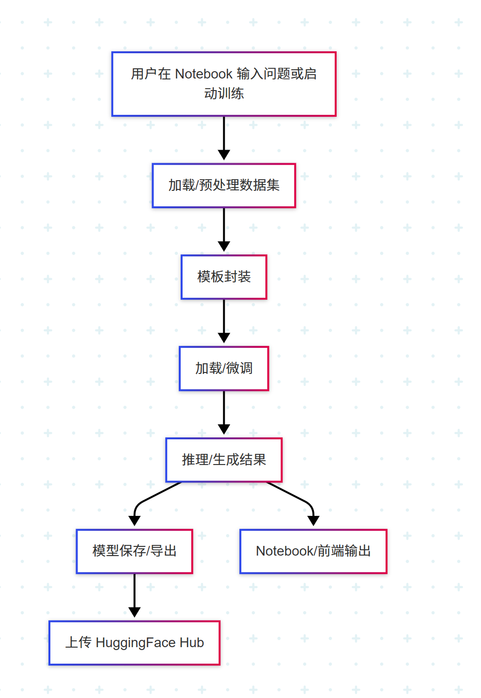

基于大模型的操作系统智能助手初步需求分析
1. 项目背景
技术趋势：大语言模型（LLM）在知识问答、代码生成、文档检索等场景展现潜力，但通用模型在垂直领域（如操作系统）存在知识覆盖不足、术语理解偏差等问题。
领域需求：操作系统课程涉及内核机制、系统调用、并发控制等复杂知识，传统检索工具缺乏语义理解能力，同学们需要更智能的交互助手。
模型选择：DeepSeek等开源大模型具备轻量化部署、多语言支持及领域微调能力，适合作为垂直领域智能助手的基础。
2. 功能需求分析
2.1 设计目标
构建操作系统领域专用智能助手，支持：专业知识问答（如Linux内核调度算法、文件系统原理等）等功能。
2.2 功能需求
知识问答：支持自然语言提问，返回准确、结构化的回答。
3. 技术需求分析
3.1 模型选型与微调
基础模型：选择DeepSeek-R1-8B
领域数据增强：使用操作系统教材、论文、内核源码注释等构建微调数据集。
指令微调：设计指令模板，提升回答精准度。
3.2 系统架构设计
 
4. 非功能需求分析
4.1 性能需求：响应时间少，支持多用户同时在线交互。
4.2 质量需求：准确性：回答事实性错误率≤5%。
5. 风险与挑战
领域知识壁垒：需与操作系统专家合作构建高质量微调数据集。
计算资源限制：DeepSeek轻量化模型可降低部署成本，但需评估GPU需求。

