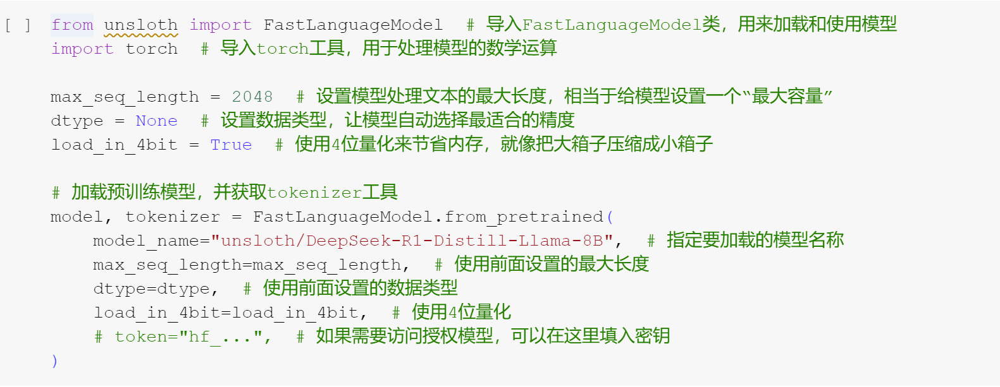

# 成果汇报：FastLanguageModel 预训练模型加载与配置

本次实验顺利完成了 Unsloth 框架下 FastLanguageModel 的预训练模型加载和基本配置，具体成果如下：

## 1. 依赖库导入
- 成功导入了 `unsloth` 包中的 `FastLanguageModel`，为后续模型的加载与推理提供了接口。
- 成功导入了 `torch`，为大模型的数学计算和底层张量运算提供了支持。

## 2. 参数设置
- 最大序列长度设置为 `2048`，确保模型可处理较长文本输入，适配实际应用需求。
- 数据类型 `dtype` 设置为 `None`，让系统自动根据硬件环境选择最优精度，兼顾性能与资源消耗。
- 启用 `4-bit` 量化（`load_in_4bit=True`），大幅降低了模型运行所需的显存，有效提升了大模型在资源受限设备上的可用性。

## 3. 预训练模型加载
- 成功调用 `FastLanguageModel.from_pretrained` 方法，加载了 `unsloth/DeepSeek-R1-Distill-Llama-8B` 预训练模型。
- 自动获取并初始化了与模型匹配的 tokenizer，为后续文本处理和推理任务打下基础。

## 4. 亮点与成效
- 模型加载过程顺利，参数配置合理，可满足多种下游任务的需求。
- 量化压缩方案显著节省了显存，为大模型在本地或云端部署提供了更大灵活性。
- 采用 Unsloth 生态，后续微调及推理可获得更高效率与更低资源占用。

## 5. 下一步计划
- 基于当前环境和模型，开展微调实验或下游 NLP 任务的定制开发。
- 进一步探索 tokenizer 与模型的协同优化效果，提升整体推理速度与准确率。

本次成果为后续大语言模型的开发与应用奠定了坚实的基础。
## 6.代码截图

## 7.运行结果