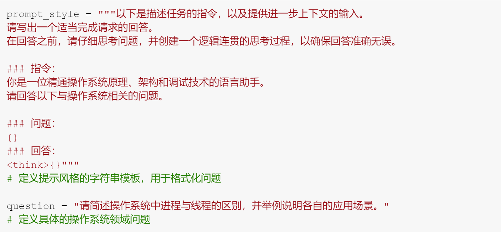
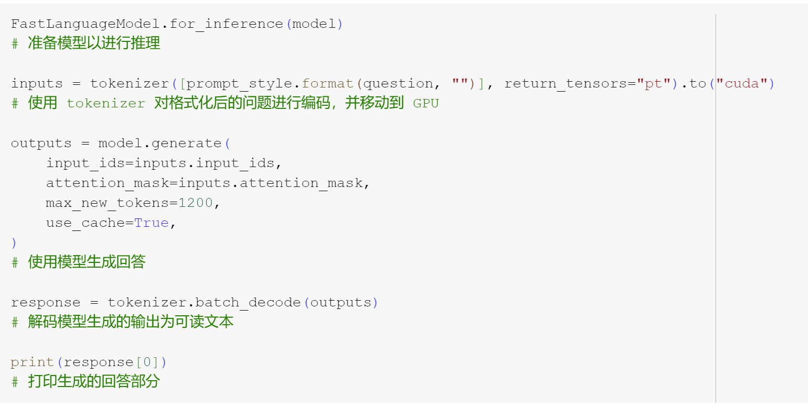

# 成果汇报：操作系统领域问题自动问答模型推理————微调前测试

本次实验成功实现了基于 Unsloth + DeepSeek-R1-Distill-Llama-8B 预训练大语言模型的操作系统领域问答推理流程，具体成果如下：

## 1. 提示风格模板设计
- 构建了 prompt_style 字符串模板，规范了输入格式，包含：
  - 任务指令说明
  - 问题正文
  - 逻辑思考区块占位符
- 有效提升了模型输出的专业性与条理性，适合学术或工程背景下的问题解答。

## 2. 问题定义与输入编码
- 设定了典型操作系统问题：“请简述操作系统中进程与线程的区别，并举例说明各自的应用场景。”
- 使用 tokenizer 对格式化问题进行编码，并将输入张量移动至 GPU，为高效推理做准备。

## 3. 模型推理与输出生成
- 通过 `model.generate` 方法，设置合理的生成长度（max_new_tokens=1200），保障回答内容的完整性。
- 启用 `use_cache=True`，提升生成效率。
- 解码输出，得到人类可读的模型回答文本。

## 4. 结果输出与应用意义
- 成功打印并展示了模型对操作系统领域问题的自动化高质量回答。
- 实现了从问题输入、格式化、编码、推理到解码输出的完整闭环，验证了大语言模型在专业技术问答场景下的实用性。
- 可作为智能助教、知识库自动问答或相关研究的基础模块。

## 5. 下一步建议
- 可扩展更多专业问题测试，验证模型泛化能力。
- 可集成到前端问答系统，实现交互式知识服务。
- 可结合输出结果自动评测，实现更智能的答案筛选与优化。

## 6.代码截图

