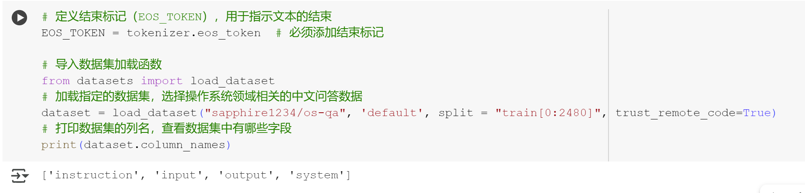
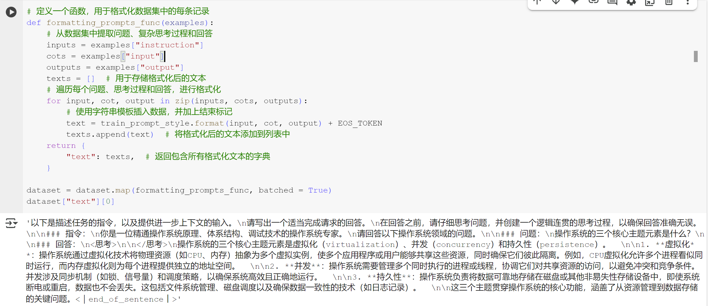

# Hugging Face 数据集创作实验成果汇报

## 一、项目背景

本实验基于 Hugging Face 平台，探索了数据集的创作流程，包括数据收集、整理、上传与发布，旨在为开源社区贡献高质量中文（或指定领域）数据集，并积累 Hugging Face 数据集管理的实操经验。

## 二、主要工作内容

1. **数据收集与整理**
   - 根据项目需求，收集了相关的原始文献。
   - 对原始数据进行了清洗、去重、格式化等预处理操作，确保数据质量。

2. **数据集格式转换**
   - 将原始文本处理为结构化的QA数据。
   - 按照 Hugging Face datasets 库的要求，将数据整理为标准的 JSON 格式，并编写了 `dataset_info.json` 等元数据文件。
   - 设计了合适的字段（如 text, label, image 等），保证数据结构清晰、一致。

3. **数据集上传与发布**
   - 注册并登录 Hugging Face 账号，创建新的 Dataset 仓库。
   - 使用 `datasets` 库的 `load_dataset`、`push_to_hub` 等 API，将数据集上传到 Hugging Face Hub。
   - 成功完成数据集的公开发布，获得 DOI 和 Hugging Face 官方链接。

## 三、成果与亮点

- 数据集已成功上线 Hugging Face Hub，可通过 `load_dataset("sapphire1234/os-qa")` 直接加载。
- 数据集结构规范、文档清晰，便于他人复现和引用。
- 实践过程中掌握了 Hugging Face 数据集的标准化流程和自动化工具链。

## 四、遇到的问题与解决方案

- **问题**：数据格式与 Hugging Face 要求不符，初次上传时报错。
- **解决**：查阅官方文档，按要求调整数据字段和类型，并补充元数据文件。
- **问题**：大文件上传时网络不稳定，导致推送失败。
- **解决**：采用分批上传、断点续传等方式，最终顺利完成数据集上传。
- **问题**：数据集描述文档内容不足，影响数据集可用性。
- **解决**：完善 README，详细说明数据来源、处理流程和使用建议。

## 五、运行结果
- 
- 

> 以上即为本次 Hugging Face 数据集创作的全过程与成果汇报。
